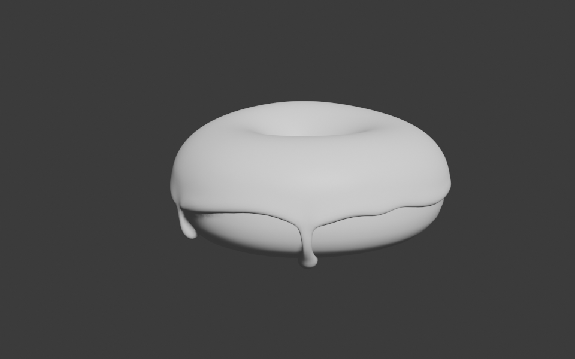

我完成了[第四节课](https://youtu.be/--GVNZnSROc)的学习，现在我的甜甜圈的糖霜变得更加逼真了😁。

在这节课中，使用了雕刻工具来实现上图的效果：

1. 使用“膨胀”功能来将糖霜的“积液”变得膨胀。
2. 使用“遮罩”来将“糖霜”的边缘进行遮挡，然后对遮罩进行反选。是的遮挡住“糖霜”的非边缘部分。
3. 使用“网格滤镜”接将“糖霜”边缘进行统一膨胀（这比使用膨胀笔刷逐步绘制要显得统一，因为它是整圈膨胀。）。
4. 使用“平滑遮罩”来将糖霜的边缘变得平滑。
5. 最后使用“光滑”工具对边缘的细节进行打磨，使得模型更加漂亮。😻
