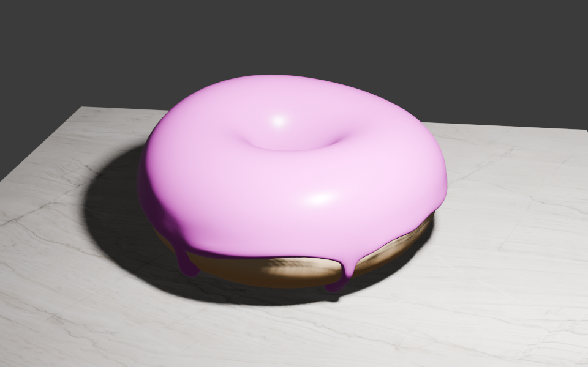

我完成了[第五课](https://www.youtube.com/watch?v=fsLO1F5x7yM&t=882s)的学习，现在我的甜甜圈有颜色了，并且还被放置在大理石桌面上。😄

这节课，学到了：

1. 利用“灰度图”来作为材质的粗度输入，从而营造出桌面的“磨损效果”；
2. 利用“法相图”作为材质法相的输入，从而营造出桌面的“坑坑洼洼”效果。
3. 利用“纹理绘制”功能创建一张纹理贴图，并且单独用笔刷来给甜甜圈本体绘制一圈“白色”。
